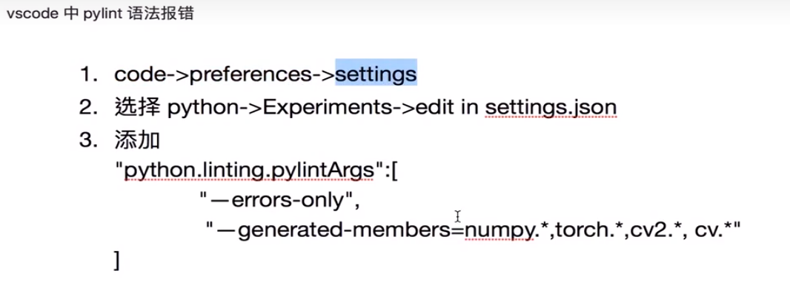

# OPenCV 基础

## 创建和显示窗口

涉及的API

- namedWindow()，创建窗口，并赋予名字
- imshow()，显示图片，如果没有创建窗口，该函数会自动创建一个和图片一样大的窗口，所以namedWindow()函数应用不多
- destroyAllWindows()，销毁所有窗口
- resizeWindow()
- waitKey()，让窗口停留，还能接收键盘和鼠标事件，参数为显示时间，单位毫秒，0为一直显示

## 打开和显示图像

`imread`函数用于读取图像，有两个参数
- path：图像路径
- flag：图像读取模式，默认为彩色的

打开图像的一般套路：

```python
# 创建窗口
cv2.namedWindow('img', cv2.WINDOW_NORMAL)
# 读取图像文件
img = cv2.imread('/home/vk/Pictures/desktop/99a.jpg')
# 将图像显示到制定窗口
cv2.imshow('img', img)
# 让窗口停留
key = cv2.waitKey(0)
# 退出处理
if key&0xFF == ord('q'):
    cv2.destroyAllWindows()
```

## 加载图片存在的问题

- 使用VSCode时，代码`cv2`部分有错误提示

- windows下的路径表示。写作  d:\\abc\\zyx.jpg   ，使用双 `\`符号作为路径分隔符
- 程序退出逻辑的问题。程序 `key = cv2.waitKey(0)` 捕获的是该字符的ASCII码（waitKey函数的返回值是整形数据，占用十六位存储空间，所以严格来说，应该将该函数捕获的结果的后八位与对应字符的ASCII比较），而不是该字符，所以比对时应该将变量 `key` 同对应字符的ASCII码对比。也可以把 `key` 转换为字符： `chr(key)` 再作比较

## opencv 保存图片

使用 `imwrite(name,img)`函数，参数含义：
-name，要保存的文件名
-img，包保存的图像对象，Mat类型

## 从摄像头采集数据

- VideoCapture()，采集器，根据设备号选择摄像头，一般为0（第一个摄像头）。在Linux中使用CAP_V4L2，Win下使用CAP_DSHOW等，默认为自动检测（0）
- read()，采集数据，返回两个值，第一个是否读到，第二个为视频帧
- release()，释放资源
- VideoWriter，把视频采集下来，第一个参数为输出文件，第二个为多媒体文件格式（fourcc），第三个帧率，第四个为分辨率（为摄像头实际分辨率，不能随便写）
- write,写入数据，同时编码
- release，把数据从缓存写入硬盘

可以使用 `isOpened()`判短摄像头是否已经打开
采集数据时要判断数据是否获取到了

## 鼠标控制

设置鼠标回调函数
setMouseCallback(winname,callback,userdata)，winname,对哪个窗口进行操作
callback,回调函数
userdata,向回调函数传递参数，默认为None

callback(event,x,y,flags,userdata)，自定义回调函数，名称自定
event,事件，鼠标移动，按左键等
x,y,鼠标坐标
flags,鼠标键和组合键
userdata,通过回调函数传过来的数据

## TrackBar 控件

TrackBar控件，就是一个滑块

createTrackbar函数，创建控件，参数：tarckbarname,winname，value（当前值），count（最大值，最小值为0），callback,userdata
getTrackbarPos函数，获取滑块位置,参数：tarckbarname,winnam;返回值是滑块当前值

