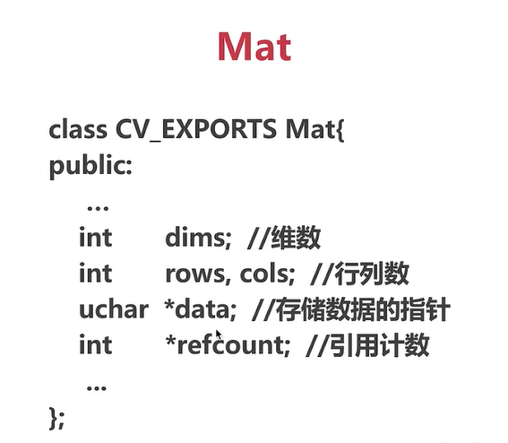
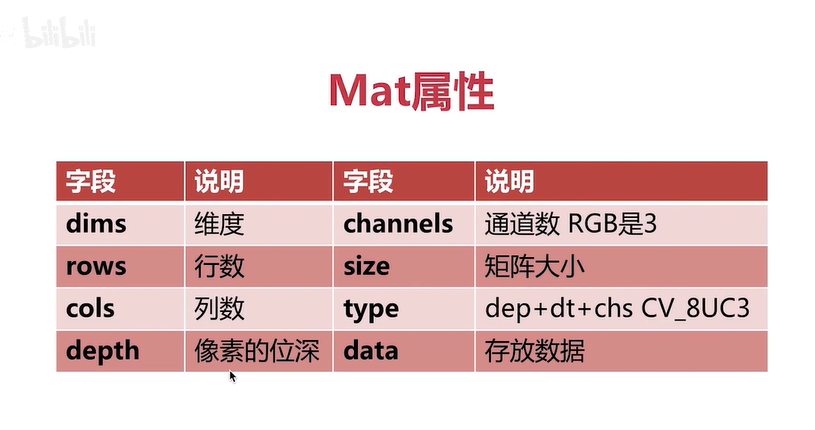
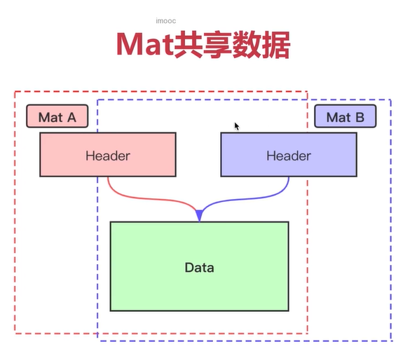
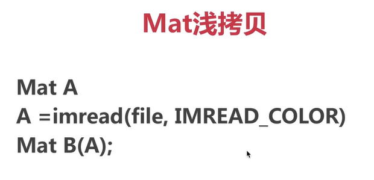
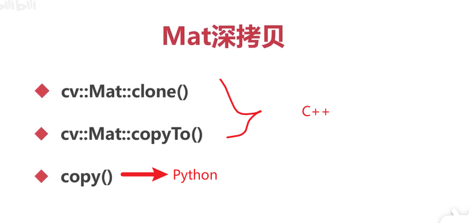

# numpy和mat对象

## numpy简介
和图像运算有关

- opencv中用到的矩阵都要转换成numpy数组
- numpy是一个经过高度优化的Python数值库

## numpy基本操作

- 创建矩阵
  - 创建数组array()，
    - 一维数组， `a=np.array([2,3,4])`
    - 二维数组， `c=np.array([[1.0,2.0],[3.0,4.0]])`
  - 创建全0数组 zeros/ones 函数
    - `c=np.zeros((480,640,3),np.uint8))`,(480,640,3)表示行数（高度），列数（宽度），通道数/层数;np.uint8表示矩阵中的数据类型，
  - 创建全值数组 full(), `c=np.full((480,640,3),255,np.uint8)` ,255表示每个元素的值
  - 创建单元数组 identity/eye()  ，单元数组，斜角为1,两侧为0
- 检索与赋值[y,x]
  - [y,x]，坐标，索引从0开始，
  - [y,x,channel]，多通道，
- 获取子数组[:,:]，ROI,Region of Image,获取图像中的一部分，
  - 方式：[y1:y2,x1:x2]，
  - 整个图像：[:,:],也可以写作roi[:]
  - roi[:,10]表示所有x为10的元素

## mat

mat是一个矩阵，可能包含多个通道。单通道为灰度图，彩色图为3通道

mat的好处：操作方便，方便numpy操作

mat有两大部分组成，header和data，header存放属性，data就是具体数值

## mat浅拷贝和深拷贝

浅拷贝：两个mat对象header不同，但data部分共用

深拷贝：

##  访问图像（Mat）的属性

- shape属性，包含高度，宽度和通道数
- size属性，占用多大空间，高度*宽度*通道数
- dtype属性，图像中每个元素的位深

## 通道的分离与合并

- split(mat)，分离通道
- merge((ch1,ch2,...))，合并，多个通道放到一个元组中
